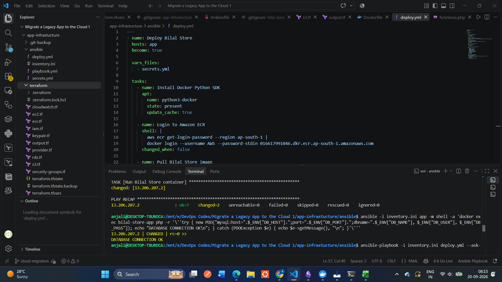
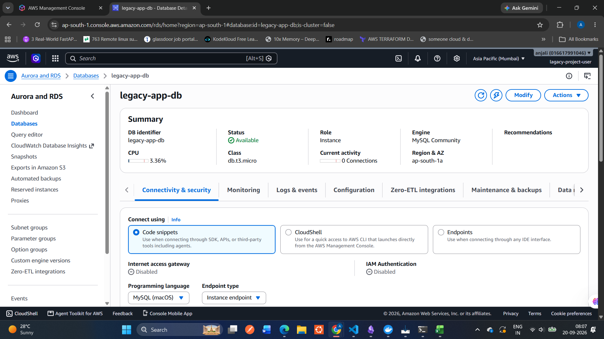
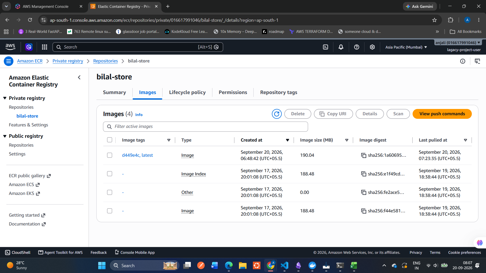
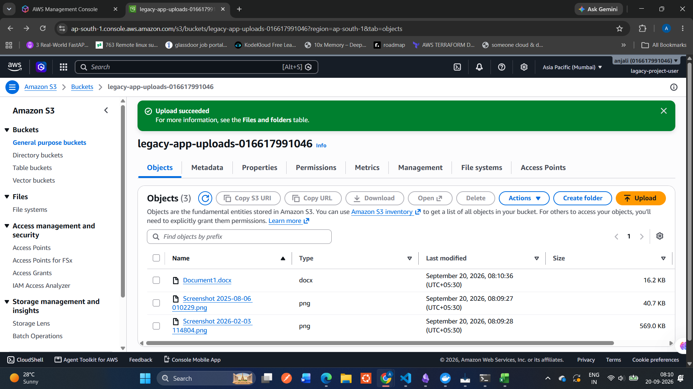
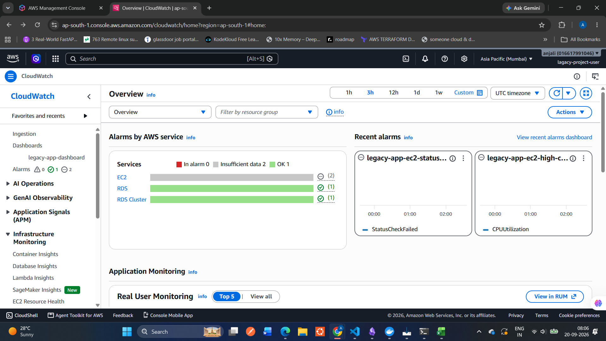
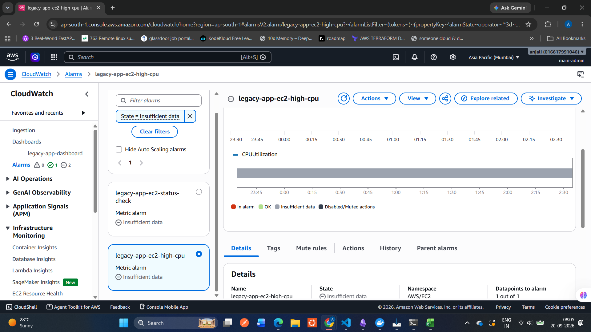
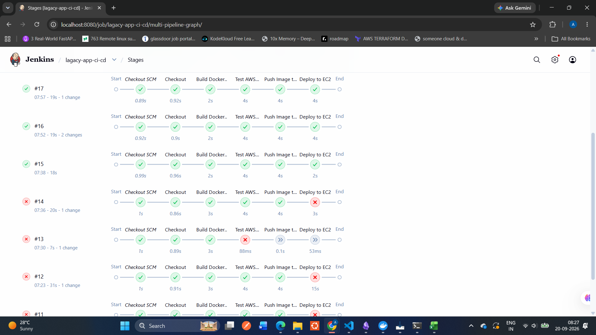

Legacy PHP Application to AWS — Cloud Modernization & DevOps Automation

A hands-on migration of a legacy PHP/MySQL e-commerce application to AWS, with Docker containerization, Infrastructure as Code, configuration automation, monitoring, and CI/CD.

📌 Project Overview

This project takes a legacy PHP/MySQL e-commerce application that was originally designed to run in a local environment and moves it to AWS.

The goal was not simply to "put the application on a server." The project introduces a repeatable DevOps workflow in which:

AWS infrastructure is provisioned with Terraform

EC2 configuration is automated with Ansible

The application is containerized with Docker

Docker images are stored in Amazon ECR

Application data is migrated to Amazon RDS for MySQL

S3 infrastructure is provisioned for object storage and validated through IAM-based EC2 access

Infrastructure is monitored with Amazon CloudWatch

Alarm notifications are delivered through Amazon SNS

Build and deployment are automated with Jenkins

Source code is maintained in GitHub

The result is a reproducible cloud deployment rather than a server that has to be configured manually every time.

🏗️ Architecture

                         DEVELOPER
                             |
                             | git push
                             v
                          GitHub
                             |
                             | Poll SCM
                             v
                          Jenkins
                    CI/CD Pipeline
                             |
          +------------------+------------------+
          |                  |                  |
          v                  v                  v
    Docker Build      AWS Authentication    Git Commit SHA
          |                  |                  |
          +------------------+------------------+
                             |
                             v
                       Amazon ECR
                       Docker Image
                             |
                             | SSH
                             v
                    +-------------------+
                    |       EC2         |
                    |                   |
                    | Docker Container  |
                    |  Bilal Store App  |
                    +---------+---------+
                              |
                    +---------+---------+
                    |                   |
                    v                   v
              Amazon RDS             Amazon S3
              MySQL Database       Object Storage
                    |
                    |
              Application Data

                 EC2 / RDS Metrics
                         |
                         v
                    CloudWatch
                         |
                         v
                       SNS
                         |
                         v
                     Email Alert

Infrastructure automation layer

Terraform
   |
   +--> VPC / Networking
   +--> Security Groups
   +--> EC2
   +--> RDS
   +--> ECR
   +--> IAM
   +--> S3
   +--> CloudWatch

Ansible
   |
   +--> Configure EC2
   +--> Install Docker dependencies
   +--> Configure application
   +--> Deploy container

Jenkins
   |
   +--> Build
   +--> Authenticate
   +--> Push to ECR
   +--> Deploy to EC2

🔄 End-to-End Deployment Flow

A code change follows this path:

Developer changes code
        |
        v
git push
        |
        v
GitHub
        |
        v
Jenkins detects repository change
        |
        v
Checkout source code
        |
        v
Build Docker image
        |
        v
Authenticate to AWS
        |
        v
Tag image with Git commit SHA
        |
        v
Push image to Amazon ECR
        |
        v
SSH to EC2
        |
        v
EC2 authenticates to ECR using IAM role
        |
        v
Pull exact image
        |
        v
Stop old container
        |
        v
Start new container
        |
        v
Application connects to RDS

This separates source control, image management, infrastructure, configuration, and deployment.

🎯 Why This Architecture?

The architecture was kept intentionally practical rather than adding services only to make the diagram larger.

Each major component has a specific responsibility:

Component

Responsibility

GitHub

Source code management

Jenkins

CI/CD automation

Docker

Application containerization

ECR

Private Docker image registry

EC2

Runs the application container

RDS

Managed MySQL database

S3

Object storage infrastructure

IAM

Authentication and authorization

Terraform

Infrastructure provisioning

Ansible

Server/application configuration

CloudWatch

Monitoring

SNS

Alarm notifications

📸 Screenshots

AWS Infrastructure

RDS / Database Migration

ECR Image

S3

CloudWatch Dashboard

CloudWatch Alarms / SNS

Jenkins Successful Pipeline

------

nv permission denied

Linux file ownership/permissions matter

📸 Screenshots

AWS Infrastructure

[Add screenshot]

RDS / Database Migration

[Add screenshot]

ECR Image

[Add screenshot]

EC2 Docker Container

[Add screenshot]

S3

[Add screenshot]

CloudWatch Dashboard

[Add screenshot]

CloudWatch Alarms / SNS

[Add screenshot]

Jenkins Successful Pipeline

[Add screenshot]

